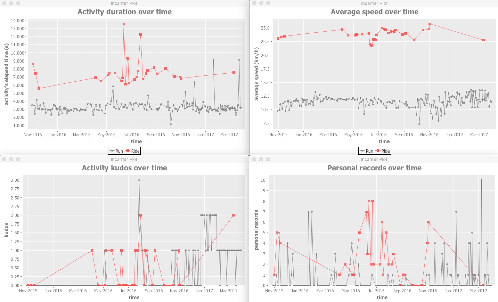

strava-activity-graphs [](https://travis-ci.org/nicokosi/strava-activity-graphs) [](https://coveralls.io/github/nicokosi/strava-activity-graphs?branch=master)
============================

Generate statistical charts for [Strava activities](https://www.strava.com/dashboard?feed_type=my_activity).

## Prerequisites

- [Install leiningen](http://leiningen.org/#install).
- Strava access token is required. You can get it [creating a Strava application](http://labs.strava.com/developers).

## Command line installation

Run `./generate-executable.sh`.

## Usage

In order to display charts in separate windows (one window per chart):

1. Generate a temporary Strava access token, for instance via <https://github.com/mgryszko/strava-access-token>.
2. Run:

```shell
# Replace $access_token with your Strava access token
lein run $access_token
```

and charts like these will be displayed:


## Developer tasks

### Run tests

```shell
lein test
```

### Format the code

Check:

```shell
lein cljfmt check
```

Format:

```shell
lein cljfmt fix
```
